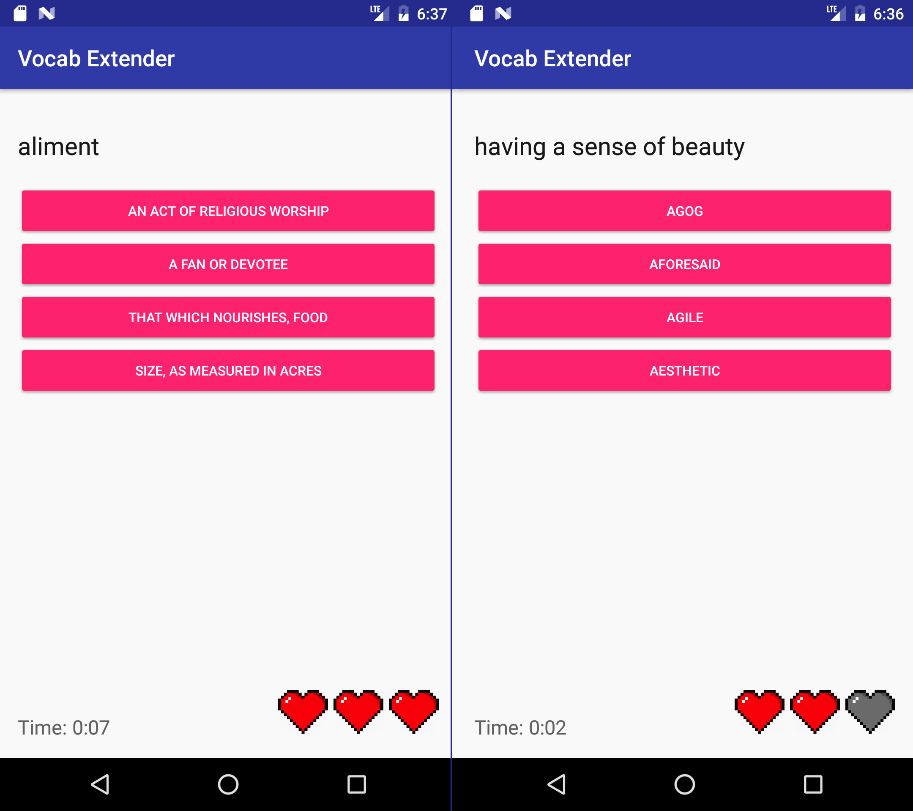

# Vocab Extender

Vocab Extender is English vocabulary learning tool to prepare for competitive exams like SAT/GRE/GMAT or simply enhance
your words repertoire.  
Built for Android SDK 16 or newer.

### Possible improvements
- create database, store it in assets and load it at installation, instead of inserting hardcoded values into SQLite
- create separate activities for Learn Mode and Test Mode
- in Test Mode change words frequency based on memorizedValue (Roulette Selection?)
- add SettingsActivity to change values like number of words to learn at a time in Learn Mode
- change Word class from Serializable to Parcelable
- move strings from Activities XML/code to a separate document
- write tests
- add some original styling to the app and sounds for correct/incorrect answers
- refactor to adhere to Android coding conventions
